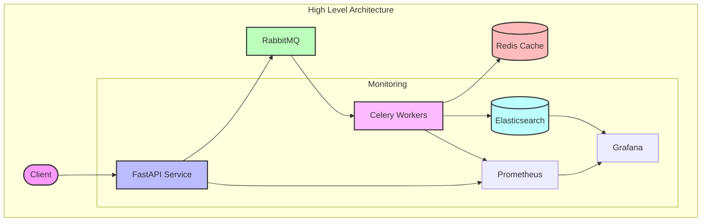
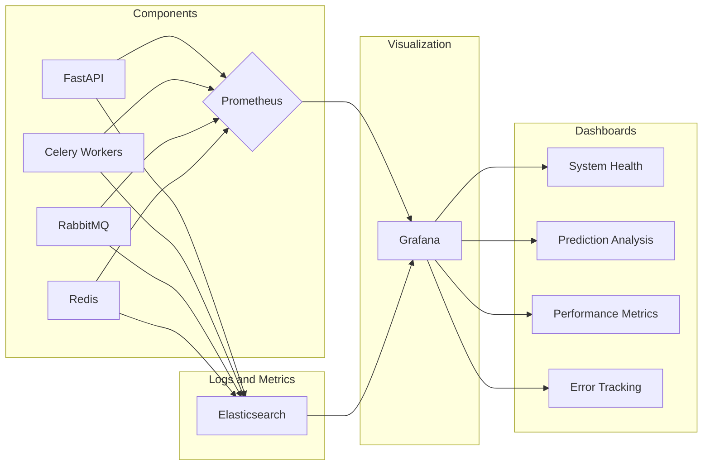

# Serving Blueprint

A production-ready ML model serving system that handles distributed inference workloads with comprehensive monitoring and analysis capabilities. This system is designed to serve machine learning models at scale while providing robust monitoring, logging, and analysis features.

## Architecture Overview

Our system implements a distributed architecture that separates concerns between model serving, task processing, and result analysis. Here's how the components work together:

### Project Overview





### Core Components

#### FastAPI Application (Central Interface)

The FastAPI application serves as our system's primary entry point, handling all incoming prediction requests. It validates incoming data, manages request routing, and provides status updates for ongoing predictions. The async capabilities of FastAPI make it ideal for handling multiple concurrent requests efficiently.

#### RabbitMQ (Message Broker)

RabbitMQ manages our task queue, ensuring reliable message delivery between components. It handles:

- Distribution of prediction tasks to available workers
- Message persistence for system reliability
- Task prioritization and routing
- Load balancing across workers

#### Celery Workers (Task Processing)

Celery workers handle the actual model inference tasks. They:

- Pick up tasks from RabbitMQ queues
- Execute model predictions
- Store results in Redis temporarily
- Handle task retries and failure scenarios

#### Redis (Caching and Task Results)

Redis serves two crucial purposes in our system:

1. Temporary storage for Celery task results, providing fast access to recent predictions
2. Caching layer for frequently accessed data, improving system performance

#### Elasticsearch (Permanent Storage and Analysis)

Elasticsearch stores prediction results and system logs for long-term analysis. It provides:

- Efficient storage and retrieval of prediction results
- Full-text search capabilities for logs and predictions
- Powerful aggregation features for analytics
- Native integration with Grafana for visualization

#### Prometheus (Performance Monitoring)

Prometheus collects metrics from all system components, tracking:

- API endpoint performance
- Worker processing times
- Queue lengths and processing rates
- System resource utilization

#### Grafana (Visualization)

Grafana creates dashboards that visualize system performance and prediction results. It connects natively to both Prometheus and Elasticsearch, providing:

- Real-time monitoring dashboards
- Prediction distribution visualizations
- Performance trend analysis
- Custom alerting based on metrics

## System Workflow

1. Request Processing:

   ```
   Client Request → FastAPI → RabbitMQ → Celery Worker → Model Inference
   ```

2. Result Handling:

   ```
   Model Prediction → Redis (temporary) → Elasticsearch (permanent)
   ```

3. Monitoring Flow:

   ```
   Components → Prometheus → Grafana Dashboards
   ```

## Project Structure

```
serving_blueprint/
├── api/
│   ├── main.py              # FastAPI application
│   ├── routes/              # API endpoints
│   └── models/              # Request/response models
├── workers/
│   ├── tasks.py             # Celery task definitions
│   └── models/              # ML model handlers
├── monitoring/
│   ├── prometheus/          # Prometheus configuration
│   └── grafana/             # Grafana dashboards
├── deployment/
│   ├── docker/              # Dockerfiles
│   └── kubernetes/          # K8s manifests
└── config/                  # Configuration files
```

## Technology Stack Explanation

### API Layer (FastAPI)

FastAPI provides a modern, fast web framework that's perfect for ML serving because:

- Automatic OpenAPI documentation
- Built-in request validation
- Excellent async support
- Type checking and IDE support

### Message Queue (RabbitMQ)

RabbitMQ handles our task distribution because it offers:

- Reliable message delivery
- Multiple queue patterns
- Message persistence
- Good monitoring tools

### Task Processing (Celery)

Celery manages our distributed tasks by providing:

- Reliable task execution
- Worker pool management
- Task retries and error handling
- Result backend support

### Caching (Redis)

Redis serves as our caching layer because it provides:

- Fast in-memory storage
- Built-in data structures
- Automatic key expiration
- Celery result backend support

### Storage (Elasticsearch)

Elasticsearch stores our prediction results and logs because it offers:

- Efficient full-text search
- Powerful aggregations
- Native Grafana integration
- Scalable storage

### Monitoring (Prometheus + Grafana)

This combination provides comprehensive monitoring:

- Metric collection and storage
- Custom dashboard creation
- Alerting capabilities
- Long-term trend analysis

## Getting Started

### Prerequisites

- Docker and Docker Compose
- Python 3.8+
- Kubernetes cluster (for production deployment)

### Local Development Setup

1. Clone the repository
2. Create a virtual environment
3. Install dependencies
4. Run development services using Docker Compose

### Production Deployment

1. Build container images
2. Apply Kubernetes manifests
3. Configure monitoring
4. Set up Grafana dashboards

## Configuration

### Environment Variables

- `RABBITMQ_URL`: RabbitMQ connection string
- `REDIS_URL`: Redis connection string
- `ELASTICSEARCH_URL`: Elasticsearch connection string
- Additional configuration variables detailed in config/

### Scaling Considerations

- Horizontal scaling of API and workers
- Redis cluster for larger deployments
- Elasticsearch cluster configuration
- RabbitMQ cluster setup

## Monitoring and Analysis

### Available Metrics

- Request latency
- Prediction distributions
- Error rates
- Queue lengths
- Worker performance

### Grafana Dashboards

- System overview
- Prediction analysis
- Performance metrics
- Error tracking

## Best Practices

### Development

- Use type hints
- Write comprehensive tests
- Document API endpoints
- Monitor resource usage

### Deployment

- Use container health checks
- Implement circuit breakers
- Set up proper logging
- Configure appropriate resource limits

### Monitoring

- Set up alerting
- Monitor queue lengths
- Track error rates
- Analyze prediction patterns

## How to run

```bash
# export requirements.txt
uv export --no-dev --no-hashes > requirements.txt

# docker compose up -d
docker compose up -d


# to build docker image
docker build -t python-fastapi:latest .
# docker build --no-cache -t python-fastapi:latest .


```
