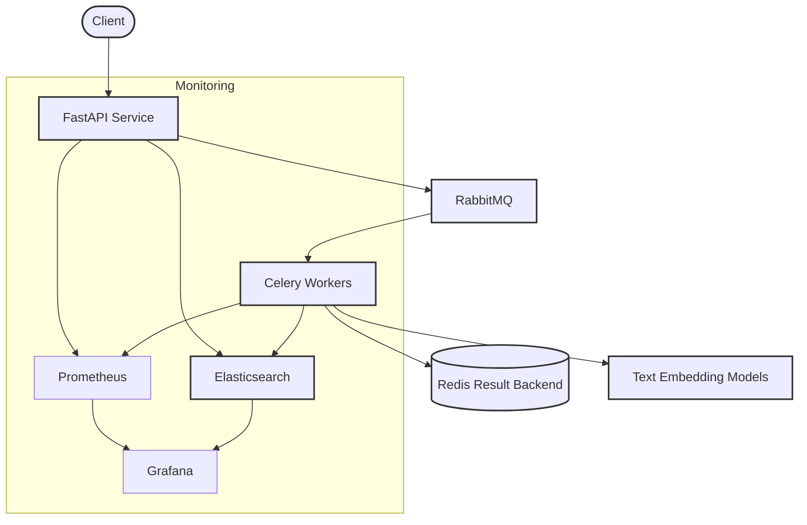

# Text Embedding Service

A scalable and production-ready system for serving text embedding models with distributed inference capabilities. This service processes text data through various embedding models while providing robust task management, monitoring, and logging features.

## Architecture Overview

The system implements a distributed architecture that separates concerns between API handling, task queuing, and worker processing:



### Core Components

#### FastAPI Application (API Layer)

The FastAPI application serves as the system's entry point, handling text embedding requests. It:
- Validates incoming requests
- Routes tasks to appropriate queues
- Provides model information endpoints
- Returns task status and results
- Includes health check endpoints

#### RabbitMQ (Message Broker)

RabbitMQ manages task distribution between components:
- Routes embedding tasks to appropriate worker queues
- Enables persistent message delivery
- Supports task prioritization and load balancing
- Creates model-specific queues for dedicated processing

#### Celery Workers (Task Processing)

Celery workers handle the actual embedding operations:
- Pull tasks from model-specific queues
- Execute text embedding with the appropriate model
- Store results in Redis
- Provide task status updates

#### Redis (Result Backend)

Redis stores task results and status information:
- Maintains task result data
- Provides fast retrieval for task status checks
- Serves as Celery's result backend

#### Text Embedding Service

The core ML component that:
- Loads and manages embedding models
- Processes text inputs into vector embeddings
- Uses light_embed library for efficient processing

#### Monitoring & Logging Stack

The system includes a comprehensive monitoring and logging solution:

**Prometheus & Grafana**
- Collects metrics from all system components
- Tracks API endpoint performance
- Monitors worker processing metrics
- Visualizes queue lengths and processing rates
- Provides dashboards for system performance

**Elasticsearch & Grafana**
- Advanced logging for all system components
- Stores structured logs with rich metadata
- Enables complex log queries and analytics
- Integrates with Grafana for log visualization
- Provides insights into system behavior and errors

## Project Structure

```
text_embedding_service/
├── src/
│   ├── api/
│   │   ├── app.py                 # FastAPI application
│   │   ├── router.py              # API router configuration
│   │   ├── schemas/               # API schema definitions
│   │   │   ├── embedding.py       # Text embedding schemas
│   │   │   └── task.py            # Task handling schemas
│   │   └── routes/
│   │       ├── health.py          # Health check endpoints
│   │       └── text_embedding.py  # Text embedding endpoints
│   ├── core/
│   │   ├── config/                # Configuration files
│   │   │   ├── main.py            # Main configuration settings
│   │   │   └── ml.py              # ML model configuration
│   │   ├── exceptions.py          # Exception handling
│   │   └── logger.py              # Logging configuration with Elasticsearch support
│   ├── ml/
│   │   └── text_embedding_service.py  # ML model handling service
│   ├── monitoring/
│   │   ├── instrumentator.py      # Prometheus instrumentation
│   │   └── metrics.py             # Custom metrics definitions
│   └── workers/
│       ├── text_embedding_workers.py  # Worker task definitions
│       └── worker.py              # Worker initialization
├── config/                        # Configuration files
│   ├── config.yaml                # Main application config
│   └── ml_config.yaml             # ML models configuration
├── mlops/                         # Monitoring configuration
│   ├── grafana/
│   │   ├── dashboards/            # Grafana dashboard definitions
│   │   └── datasources/           # Datasource configurations
│   └── prometheus/
│       └── prometheus.yml         # Prometheus configuration
├── models/                        # Pre-trained models
│   ├── all-MiniLM-L12-v2-onnx/    # ONNX embedding models
│   ├── all-MiniLM-L6-v2-onnx/
│   └── ...
├── Dockerfile.api                 # Docker config for API service
├── Dockerfile.worker              # Docker config for workers
├── compose.yaml                   # Main Docker Compose config
├── compose.api.yaml               # API service Docker Compose config
├── compose.mo.yaml                # Monitoring services Docker Compose config
├── compose.rr.yaml                # Redis/RabbitMQ Docker Compose config
└── Makefile                       # Build and deployment automation
```

## Workflow

1. **Request Processing**:
   ```
   Client Request → FastAPI → RabbitMQ → Celery Worker → Text Embedding Model
   ```

2. **Result Handling**:
   ```
   Model Inference → Redis (Result Storage) → API Response
   ```

3. **Monitoring & Logging**:
   ```
   Components → Prometheus/Elasticsearch → Grafana Dashboards
   ```

## Getting Started

### Prerequisites

- Docker and Docker Compose
- Python 3.8+
- uv (Python package manager) for dependency management

### Local Development Setup

1. Clone the repository
2. Use the provided `.env` file or create your own with the required environment variables:
   ```
   # API Configuration
   API_PORT=8000
   API_HOST=0.0.0.0
   
   # RabbitMQ Configuration
   RABBITMQ_HOST=rabbitmq
   RABBITMQ_USER=guest
   RABBITMQ_PASSWORD=guest
   RABBITMQ_PORT=5672
   RABBITMQ_MANAGEMENT_PORT=15672
   
   # Redis Configuration
   REDIS_HOST=redis
   REDIS_PORT=6379
   REDIS_PASSWORD=your_redis_password
   
   # Elasticsearch Configuration
   ELASTICSEARCH_HOST=elasticsearch
   ELASTICSEARCH_PORT=9200
   
   # Flower Configuration
   FLOWER_PORT=5555
   FLOWER_USER=admin
   FLOWER_PASSWORD=admin
   
   # Logging Configuration
   LOG_LEVEL=INFO
   LOGGER_HANDLER=elasticsearch
   LOG_DIR=logs
   
   # Model Configuration
   ML_CONFIG_PATH=config/ml_config.yaml
   ```
3. Start the services using Make or Docker Compose:
   ```bash
   # Start all services
   make start
   
   # Or start individual components
   make start-api      # Start just the API service
   make start-redis-mq # Start Redis and RabbitMQ
   make start-monitor  # Start monitoring stack (Prometheus, Elasticsearch, Grafana)
   
   # Alternatively, using Docker Compose directly
   docker compose up -d                   # Start all services
   docker compose -f compose.api.yaml up  # Start just the API
   docker compose -f compose.rr.yaml up   # Start Redis and RabbitMQ
   docker compose -f compose.mo.yaml up   # Start monitoring stack
   ```