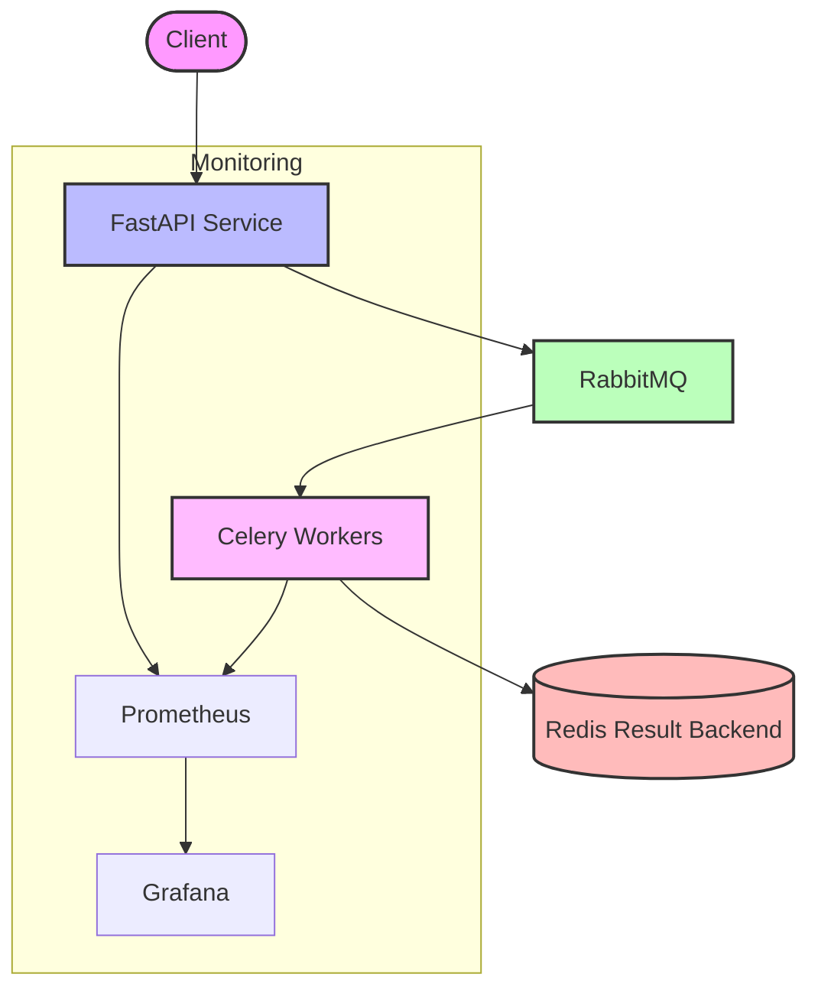

# Text Embedding Service

A scalable and production-ready system for serving text embedding models with distributed inference capabilities. This service processes text data through various embedding models while providing robust task management, monitoring, and logging features.

## Architecture Overview

The system implements a distributed architecture that separates concerns between API handling, task queuing, and worker processing:



### Core Components

#### FastAPI Application (API Layer)

The FastAPI application serves as the system's entry point, handling text embedding requests. It:
- Validates incoming requests
- Routes tasks to appropriate queues
- Provides model information endpoints
- Returns task status and results
- Includes health check endpoints

#### RabbitMQ (Message Broker)

RabbitMQ manages task distribution between components:
- Routes embedding tasks to appropriate worker queues
- Enables persistent message delivery
- Supports task prioritization and load balancing
- Creates model-specific queues for dedicated processing

#### Celery Workers (Task Processing)

Celery workers handle the actual embedding operations:
- Pull tasks from model-specific queues
- Execute text embedding with the appropriate model
- Store results in Redis
- Provide task status updates

#### Redis (Result Backend)

Redis stores task results and status information:
- Maintains task result data
- Provides fast retrieval for task status checks
- Serves as Celery's result backend

#### Flower (Celery Monitoring)

Flower provides real-time monitoring for Celery workers (configuration included but not active yet):
- Dashboard for task progress and status
- Worker status monitoring
- Task history and statistics
- Performance insights

#### Prometheus (Monitoring)

Prometheus collects metrics from all system components (currently in development):
- API endpoint performance
- Worker processing metrics
- Queue lengths and processing rates
- Error tracking and system resource utilization

## Project Structure

```
text_embedding_service/
├── src/
│   ├── api/
│   │   ├── app.py                 # FastAPI application
│   │   ├── router.py              # API router configuration
│   │   └── routes/
│   │       ├── health.py          # Health check endpoints
│   │       └── text_embedding.py  # Text embedding endpoints
│   ├── core/
│   │   ├── config/                # Configuration files
│   │   └── logger.py              # Logging configuration
│   ├── ml/
│   │   └── text_embedding_service.py  # ML model handling service
│   ├── monitoring/
│   │   ├── instrumentator.py      # Prometheus instrumentation
│   │   └── metrics.py             # Custom metrics definitions
│   └── workers/
│       ├── text_embedding_workers.py  # Worker task definitions
│       └── worker.py              # Worker initialization
├── Dockerfile.api                 # Docker config for API service
├── Dockerfile.worker              # Docker config for workers
├── compose.yaml                   # Main Docker Compose config
├── compose.api.yaml               # API service Docker Compose config
└── compose.rr.yaml                # Redis/RabbitMQ Docker Compose config
```

## Workflow

1. **Request Processing**:
   ```
   Client Request → FastAPI → RabbitMQ → Celery Worker → ML Model Inference
   ```

2. **Result Handling**:
   ```
   Model Inference → Redis (Result Storage) → API Response
   ```

3. **Monitoring** (In development):
   ```
   Components → Prometheus → Grafana Dashboards
   ```

## Getting Started

### Prerequisites

- Docker and Docker Compose
- Python 3.8+
- uv (Python package manager) for dependency management

### Local Development Setup

1. Clone the repository
2. Use the provided `.env` file or create your own with the required environment variables:
   ```
   # API Configuration
   API_PORT=8000
   API_HOST=0.0.0.0
   
   # RabbitMQ Configuration
   RABBITMQ_HOST=rabbitmq
   RABBITMQ_USER=guest
   RABBITMQ_PASSWORD=guest
   RABBITMQ_PORT=5672
   RABBITMQ_MANAGEMENT_PORT=15672
   
   # Redis Configuration
   REDIS_HOST=redis
   REDIS_PORT=6379
   REDIS_PASSWORD=your_redis_password
   
   # Flower Configuration
   FLOWER_PORT=5555
   FLOWER_USER=admin
   FLOWER_PASSWORD=admin
   ```
3. Start the services using Make or Docker Compose:
   ```bash
   # Using Make
   make start
   
   # Or using Docker Compose directly
   docker compose up -d
   ```

### Available Endpoints

- `GET /api/health` - Service health check
- `GET /api/v1/embedding/models` - List available embedding models
- `POST /api/v1/embedding/` - Create embedding for text
- `GET /api/v1/embedding/{task_id}` - Get embedding task results

## Technology Stack

- **FastAPI**: Modern, high-performance web framework
- **Celery**: Distributed task queue
- **RabbitMQ**: Message broker
- **Redis**: Result backend and caching
- **Prometheus**: Metrics collection (in development)
- **Grafana**: Visualization (in development)
- **Docker & Docker Compose**: Containerization and orchestration

## Current Development Status

### Implemented Features
- ✅ FastAPI application with embedding endpoints
- ✅ Celery workers for distributed processing
- ✅ RabbitMQ message queuing
- ✅ Redis result backend
- ✅ Model-specific worker configuration
- ✅ Basic health check endpoints
- ✅ Docker containerization

### In Progress / To Do
- ⏳ Complete Prometheus metrics integration
- ⏳ Grafana dashboard setup
- ⏳ Error handling improvements
- ⏳ Enhanced logging
- ⏳ Unit and integration tests
- ⏳ CI/CD pipeline
- ⏳ Kubernetes deployment configuration

## Environment Variables

The project uses a `.env` file for configuration. Here are the key environment variables:

| Variable | Description | Default |
|----------|-------------|---------|
| API_HOST | API service hostname | 0.0.0.0 |
| API_PORT | API service port | 8000 |
| RABBITMQ_HOST | RabbitMQ server hostname | rabbitmq |
| RABBITMQ_USER | RabbitMQ username | guest |
| RABBITMQ_PASSWORD | RabbitMQ password | guest |
| RABBITMQ_PORT | RabbitMQ service port | 5672 |
| RABBITMQ_MANAGEMENT_PORT | RabbitMQ management UI port | 15672 |
| REDIS_HOST | Redis server hostname | redis |
| REDIS_PORT | Redis service port | 6379 |
| REDIS_PASSWORD | Redis password | your_redis_password |
| FLOWER_PORT | Flower monitoring UI port | 5555 |
| FLOWER_USER | Flower admin username | admin |
| FLOWER_PASSWORD | Flower admin password | admin |
| LOG_LEVEL | Logging level | INFO |
| MODEL_TYPE | Type of model for worker | text_embedding |
| MODEL_KEY | Model key for worker | - |

> Note: The `.env` file includes commented alternative configurations for local development vs. containerized services. Adjust the host settings depending on your deployment environment.

## Running in Production

For production environments:

1. Configure appropriate resource limits in Docker Compose files
2. Set up proper monitoring and alerting
3. Implement proper security measures (API authentication, secure connections)
4. Consider using Kubernetes for container orchestration

## Contributing

When contributing to this project:
1. Fork the repository
2. Create a feature branch
3. Add your changes
4. Submit a pull request

## How to Run

The project includes a Makefile with useful commands for common operations:

```bash
# Generate requirements.txt file
make create-req-file

# Generate development requirements
make create-dev-req-file

# Start all services
make start

# Stop all services
make stop

# View service logs
make logs

# Clean Python cache files
make clean-file

# Format code using ruff
make format

# Lint code using ruff
make lint

# Display help with all available commands
make help
```

Alternative Docker commands:

```bash
# Start all services
docker compose up -d

# Start only API service
docker compose -f compose.api.yaml up -d

# Start only Redis and RabbitMQ
docker compose -f compose.rr.yaml up -d

# Build specific Docker image
docker build -t text-embedding-api:latest -f Dockerfile.api .
```